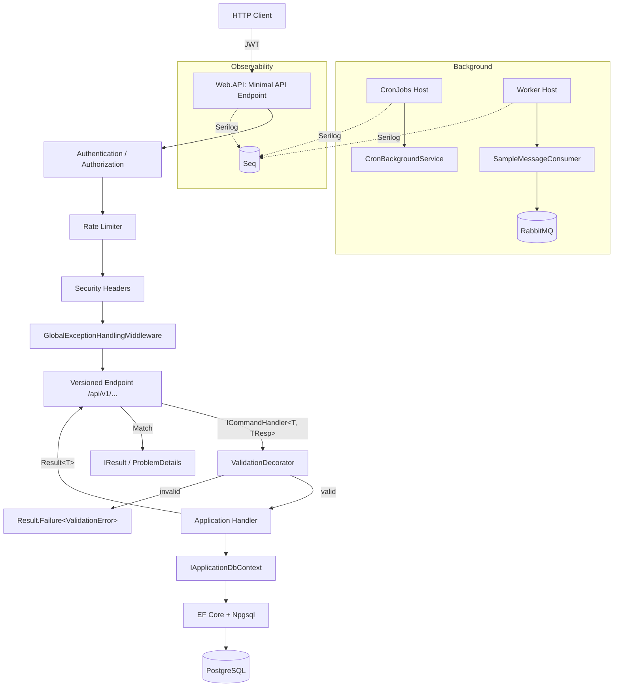
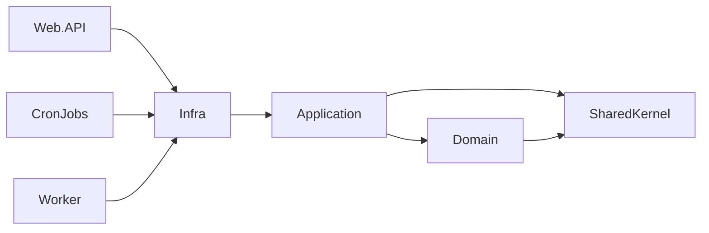
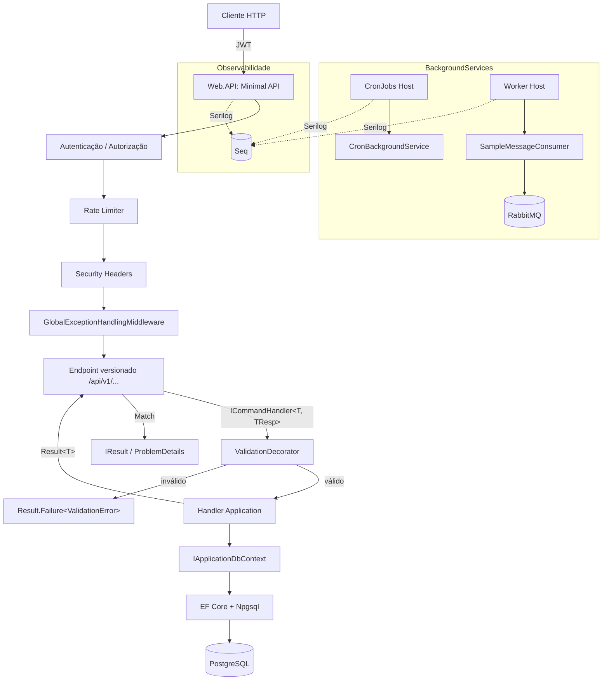

# BaseProjectScaffold

.NET 9 Clean Architecture / DDD scaffold with EF Core + PostgreSQL, JWT auth, Serilog + Seq, FluentValidation, xUnit/Shouldly/Moq/NetArchTest, CronJobs (Cronos) and a RabbitMQ Worker.

---

## 🇬🇧 English

### Stack

- .NET 9, C# 12, Central Package Management
- ASP.NET Core Minimal APIs + `Asp.Versioning`
- EF Core 9 + Npgsql + snake_case naming
- JWT Bearer Authentication
- Serilog (Console + Seq)
- FluentValidation (pipeline via Scrutor `TryDecorate`)
- xUnit + Shouldly + Moq + NetArchTest + `Microsoft.AspNetCore.Mvc.Testing`
- RabbitMQ.Client 7.x (async)
- Cronos (cron expressions)
- Docker Compose (postgres, rabbitmq, seq, web.api)

### Project layout

```
src/
├── SharedKernel/          # Result, Error, Entity, Enumeration
├── Domain/                # Aggregates, domain errors (no deps)
├── Application/           # Use cases, IQueryHandler/ICommandHandler, validators
├── Infra/                 # EF Core, ApplicationDbContext, auth services
├── Web.API/               # Minimal APIs, middleware, versioning
├── CronJobs/              # BackgroundService + Cronos-based scheduler
└── Worker/                # RabbitMQ consumer BackgroundService

tests/
├── Domain.UnitTests/
├── Application.UnitTests/
└── Web.API.IntegrationTests/   # WebApplicationFactory + architecture tests
```

### Prerequisites

- .NET 9 SDK (`global.json` pins `9.0.0`)
- Docker + Docker Compose (for Postgres/RabbitMQ/Seq)
- `psql` / `dotnet-ef` optional for migrations

### Installation

```bash
git clone git@github.com:DiegoModesto/scaffold-backend.git
cd scaffold-backend

# restore + build
dotnet restore
dotnet build BaseProjectScaffold.sln

# run tests
dotnet test BaseProjectScaffold.sln
```

### Required environment variables

The base `appsettings.json` ships with empty secrets on purpose. Provide them via environment variables (or user-secrets in dev):

| Variable                 | Description                                         | Required  |
|--------------------------|-----------------------------------------------------|-----------|
| `DB_CONNECTION_STRING`   | Postgres connection string                          | ✅         |
| `JWT_SECRET`             | Signing key ≥ 32 bytes (256 bits)                   | ✅         |
| `JWT_ISSUER`             | JWT `iss` claim                                     | optional  |
| `JWT_AUDIENCE`           | JWT `aud` claim                                     | optional  |
| `JWT_EXPIRATION_MINUTES` | Access token TTL                                    | optional  |
| `RABBITMQ_HOST`          | RabbitMQ host (Worker only)                         | Worker    |
| `RABBITMQ_USER`          | RabbitMQ user                                       | Worker    |
| `RABBITMQ_PASSWORD`      | RabbitMQ password                                   | Worker    |

> `appsettings.Development.json` already provides safe local defaults for `dotnet run`.

### Running locally

**Option A — Docker Compose (everything):**

```bash
docker compose up -d
# Web.API   → http://localhost:8080
# Seq       → http://localhost:5341
# RabbitMQ  → http://localhost:15672  (guest/guest)
# Postgres  → localhost:5432
```

**Option B — Services via Compose, API via `dotnet run`:**

```bash
docker compose up -d postgres rabbitmq seq
dotnet run --project src/Web.API
# Swagger UI → https://localhost:xxxx/swagger
```

### Running the Workers

```bash
dotnet run --project src/CronJobs      # cron-based background jobs
dotnet run --project src/Worker        # RabbitMQ consumer
```

### EF Core migrations

```bash
# create a migration
dotnet ef migrations add <Name> \
  --project src/Infra \
  --startup-project src/Web.API \
  --output-dir Database/Migrations

# apply to db
dotnet ef database update \
  --project src/Infra \
  --startup-project src/Web.API
```

### Testing

```bash
dotnet test BaseProjectScaffold.sln                                       # everything
dotnet test tests/Application.UnitTests/Application.UnitTests.csproj      # unit tests
dotnet test tests/Web.API.IntegrationTests/...                            # integration + architecture
```

Integration tests use `WebApplicationFactory<Program>` with an in-memory EF provider and a signed test JWT — no external services required.

### Security highlights

- JWT secret is validated at startup (≥ 256 bits, fails fast)
- `RequireAuthorization()` on every endpoint by default
- Security headers middleware: `X-Content-Type-Options`, `X-Frame-Options`, `Referrer-Policy`, `Permissions-Policy`, `Cross-Origin-Opener-Policy`
- HSTS + HTTPS redirection outside Development
- Configurable CORS (`Cors:AllowedOrigins`)
- Global rate limiter (fixed window, 100 req/min per identity)
- `GlobalExceptionHandlingMiddleware` never leaks stack traces

### Navigation / request flow



### Layered dependency rules (enforced by architecture tests)



- `Domain` has **no** dependencies on Application / Infra / EF Core
- `Application` has **no** dependencies on Infra / ASP.NET Core
- `Infra` has **no** dependency on Web.API
- All command/query handlers must be `sealed`
- All endpoints must be `sealed`

### Adding a new use case

1. Create command/query record in `src/Application/<Feature>/<Action>/`
2. Create handler (`public sealed` + `ICommandHandler<T, TResp>` or `IQueryHandler<T, TResp>`)
3. Create `AbstractValidator<T>` for validation (optional but recommended)
4. Add endpoint in `src/Web.API/Endpoints/<Feature>/` implementing `IEndpoint`
5. Inject the **interface** (not the concrete handler) so the ValidationDecorator runs
6. Write unit tests in `Application.UnitTests` + integration tests in `Web.API.IntegrationTests`

---

## 🇧🇷 Português

### Stack

- .NET 9, C# 12, Central Package Management
- ASP.NET Core Minimal APIs + `Asp.Versioning`
- EF Core 9 + Npgsql + convenção snake_case
- JWT Bearer Authentication
- Serilog (Console + Seq)
- FluentValidation (pipeline via Scrutor `TryDecorate`)
- xUnit + Shouldly + Moq + NetArchTest + `Microsoft.AspNetCore.Mvc.Testing`
- RabbitMQ.Client 7.x (API assíncrona)
- Cronos (expressões cron)
- Docker Compose (postgres, rabbitmq, seq, web.api)

### Estrutura

```
src/
├── SharedKernel/          # Result, Error, Entity, Enumeration
├── Domain/                # Agregados, erros de domínio (sem dependências)
├── Application/           # Casos de uso, handlers, validators
├── Infra/                 # EF Core, ApplicationDbContext, serviços de auth
├── Web.API/               # Minimal APIs, middleware, versionamento
├── CronJobs/              # BackgroundService + agendador Cronos
└── Worker/                # Consumer RabbitMQ em BackgroundService

tests/
├── Domain.UnitTests/
├── Application.UnitTests/
└── Web.API.IntegrationTests/   # WebApplicationFactory + testes de arquitetura
```

### Pré-requisitos

- SDK .NET 9 (`global.json` fixa em `9.0.0`)
- Docker + Docker Compose (Postgres / RabbitMQ / Seq)
- `dotnet-ef` opcional para migrations

### Instalação

```bash
git clone git@github.com:DiegoModesto/scaffold-backend.git
cd scaffold-backend

dotnet restore
dotnet build BaseProjectScaffold.sln

dotnet test BaseProjectScaffold.sln
```

### Variáveis de ambiente obrigatórias

O `appsettings.json` base vem com secrets vazios de propósito. Use env vars (ou user-secrets em dev):

| Variável                 | Descrição                                       | Obrigatória |
|--------------------------|--------------------------------------------------|-------------|
| `DB_CONNECTION_STRING`   | Connection string Postgres                       | ✅           |
| `JWT_SECRET`             | Chave de assinatura ≥ 32 bytes (256 bits)        | ✅           |
| `JWT_ISSUER`             | Claim `iss` do JWT                               | opcional    |
| `JWT_AUDIENCE`           | Claim `aud` do JWT                               | opcional    |
| `JWT_EXPIRATION_MINUTES` | TTL do access token                              | opcional    |
| `RABBITMQ_HOST`          | Host do RabbitMQ (Worker)                        | Worker      |
| `RABBITMQ_USER`          | Usuário RabbitMQ                                 | Worker      |
| `RABBITMQ_PASSWORD`      | Senha RabbitMQ                                   | Worker      |

> O `appsettings.Development.json` já traz defaults locais seguros para `dotnet run`.

### Executando localmente

**Opção A — Docker Compose (tudo):**

```bash
docker compose up -d
# Web.API   → http://localhost:8080
# Seq       → http://localhost:5341
# RabbitMQ  → http://localhost:15672  (guest/guest)
# Postgres  → localhost:5432
```

**Opção B — Serviços via Compose, API via `dotnet run`:**

```bash
docker compose up -d postgres rabbitmq seq
dotnet run --project src/Web.API
# Swagger UI → https://localhost:xxxx/swagger
```

### Workers

```bash
dotnet run --project src/CronJobs      # jobs em background (cron)
dotnet run --project src/Worker        # consumer RabbitMQ
```

### Migrations EF Core

```bash
# criar migration
dotnet ef migrations add <Nome> \
  --project src/Infra \
  --startup-project src/Web.API \
  --output-dir Database/Migrations

# aplicar no banco
dotnet ef database update \
  --project src/Infra \
  --startup-project src/Web.API
```

### Testes

```bash
dotnet test BaseProjectScaffold.sln                                       # tudo
dotnet test tests/Application.UnitTests/Application.UnitTests.csproj      # unit
dotnet test tests/Web.API.IntegrationTests/...                            # integração + arquitetura
```

Testes de integração usam `WebApplicationFactory<Program>` com EF InMemory e JWT de teste assinado — nada externo é necessário.

### Segurança

- JWT secret validado no startup (≥ 256 bits, fail-fast)
- `RequireAuthorization()` em todos os endpoints por padrão
- Middleware de security headers: `X-Content-Type-Options`, `X-Frame-Options`, `Referrer-Policy`, `Permissions-Policy`, `Cross-Origin-Opener-Policy`
- HSTS + redirect HTTPS fora de Development
- CORS configurável via `Cors:AllowedOrigins`
- Rate limiter global (janela fixa, 100 req/min por identidade)
- `GlobalExceptionHandlingMiddleware` nunca expõe stack traces

### Fluxo de navegação



### Regras de dependência entre camadas (validadas por testes de arquitetura)


- `Domain` **não** depende de Application / Infra / EF Core
- `Application` **não** depende de Infra / ASP.NET Core
- `Infra` **não** depende de Web.API
- Todos os handlers de command/query devem ser `sealed`
- Todos os endpoints devem ser `sealed`

### Adicionando um novo caso de uso

1. Crie o command/query record em `src/Application/<Feature>/<Action>/`
2. Crie o handler (`public sealed` + `ICommandHandler<T, TResp>` ou `IQueryHandler<T, TResp>`)
3. Crie um `AbstractValidator<T>` (opcional, mas recomendado)
4. Adicione um endpoint em `src/Web.API/Endpoints/<Feature>/` implementando `IEndpoint`
5. Injete a **interface** (e não o handler concreto) para que o `ValidationDecorator` seja aplicado
6. Escreva testes em `Application.UnitTests` e testes de integração em `Web.API.IntegrationTests`

---

## License

MIT
