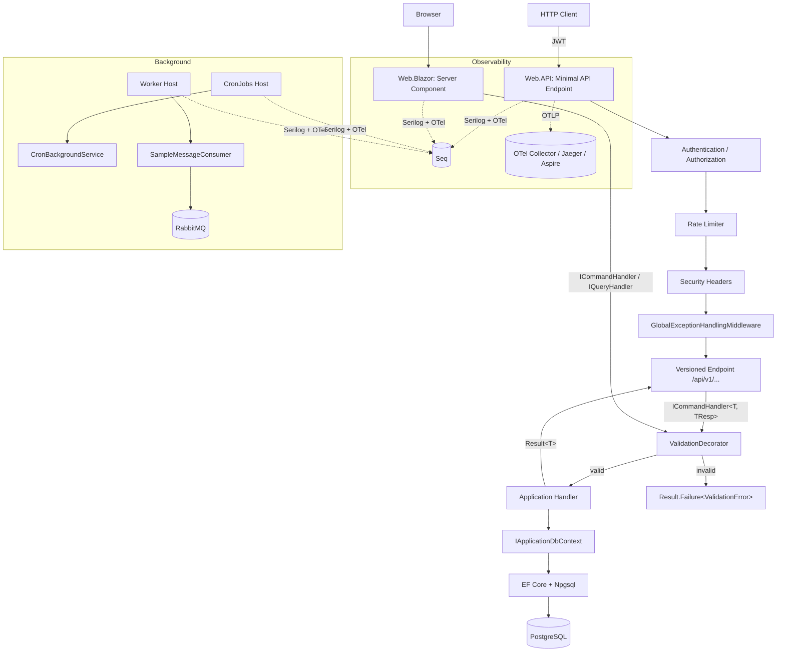
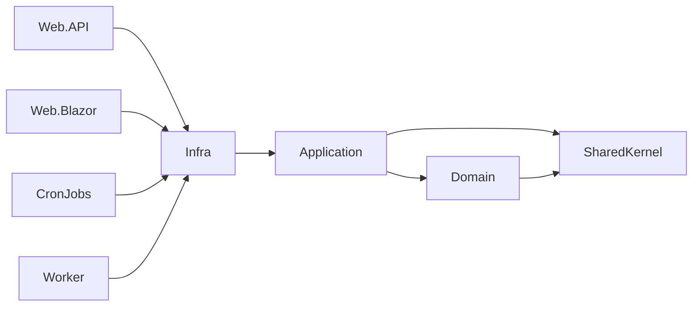
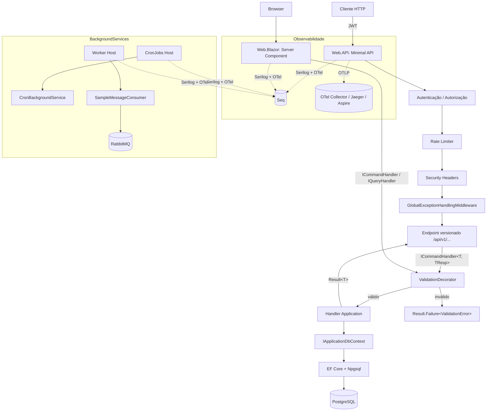

# BaseProjectScaffold

.NET 10 Clean Architecture / DDD scaffold with EF Core + PostgreSQL, JWT auth, Serilog + Seq, OpenTelemetry, FluentValidation, xUnit/Shouldly/Moq/NetArchTest, four entrypoints (Web.API, Web.Blazor, CronJobs, Worker) and shared RabbitMQ messaging.

---

## 🇬🇧 English

### Stack

- .NET 10 (LTS), C# 14, Central Package Management
- ASP.NET Core Minimal APIs + `Asp.Versioning` 10
- Blazor Server (Interactive Server render mode)
- EF Core 10 + Npgsql + snake_case naming
- JWT Bearer Authentication
- Serilog (Console + Seq) + structured request logging
- **OpenTelemetry** (traces + metrics, OTLP exporter)
- FluentValidation (pipeline via Scrutor `TryDecorate`)
- xUnit + Shouldly + Moq + NetArchTest + `Microsoft.AspNetCore.Mvc.Testing`
- RabbitMQ.Client 7.x (async)
- Cronos (cron expressions)
- Docker Compose (postgres, rabbitmq, seq, web.api, web.blazor, worker, cronjobs)

### Project layout

```
src/
├── SharedKernel/                # Result, Error, Entity, Enumeration
├── Domain/                      # Aggregates, domain errors (no deps)
├── Application/                 # Use cases, ICommandHandler/IQueryHandler, validators
├── Infra/                       # EF Core, ApplicationDbContext, auth, RabbitMQ publisher
│   ├── Messaging/               # RabbitMqConnectionFactory, RabbitMqMessagePublisher
│   └── Observability/           # OpenTelemetryExtensions
└── EntryPoints/
    ├── Web.API/                 # Minimal APIs, middleware, versioning
    ├── Web.Blazor/              # Blazor Server (Interactive Server components)
    ├── CronJobs/                # BackgroundService + Cronos scheduler
    └── Worker/                  # RabbitMQ consumer BackgroundService

tests/
├── Domain.UnitTests/
├── Application.UnitTests/
└── Web.API.IntegrationTests/    # WebApplicationFactory + architecture tests
```

### Prerequisites

- .NET 10 SDK (`global.json` pins `10.0.203`, `latestFeature` rollForward)
- Docker + Docker Compose (for Postgres / RabbitMQ / Seq)
- `dotnet-ef` optional for migrations

### Installation

```bash
git clone git@github.com:DiegoModesto/scaffold-backend.git
cd scaffold-backend

# restore + build (uses repo-local .nuget-cache/, gitignored)
dotnet restore
dotnet build BaseProjectScaffold.sln

# run tests (35 across 3 suites)
dotnet test BaseProjectScaffold.sln
```

> NuGet uses a repo-local `.nuget-cache/` configured in `nuget.config`. Delete it for a clean restore.

### Required environment variables

The base `appsettings.json` ships with empty secrets on purpose. Provide them via environment variables (or user-secrets in dev):

| Variable                       | Description                                     | Required        |
|--------------------------------|-------------------------------------------------|-----------------|
| `DB_CONNECTION_STRING`         | Postgres connection string                      | ✅              |
| `JWT_SECRET`                   | Signing key ≥ 32 bytes (256 bits)               | ✅              |
| `JWT_ISSUER`                   | JWT `iss` claim                                 | optional        |
| `JWT_AUDIENCE`                 | JWT `aud` claim                                 | optional        |
| `JWT_EXPIRATION_MINUTES`       | Access token TTL                                | optional        |
| `RABBITMQ_HOST`                | RabbitMQ host                                   | Worker / publishers |
| `RABBITMQ_USER`                | RabbitMQ user                                   | Worker / publishers |
| `RABBITMQ_PASSWORD`            | RabbitMQ password                               | Worker / publishers |
| `OTEL_EXPORTER_OTLP_ENDPOINT`  | OTLP collector endpoint (e.g. `http://localhost:4317`) | optional |

> `appsettings.Development.json` already provides safe local defaults for `dotnet run`.

### Running locally

**Option A — Docker Compose (everything):**

```bash
docker compose up -d
# Web.API     → http://localhost:5000
# Web.Blazor  → http://localhost:5002
# Seq         → http://localhost:5341
# RabbitMQ    → http://localhost:15672  (guest/guest)
# Postgres    → localhost:5432
```

**Option B — Services via Compose, apps via `dotnet run`:**

```bash
docker compose up -d postgres rabbitmq seq
dotnet run --project src/EntryPoints/Web.API     # https://localhost:xxxx/swagger
dotnet run --project src/EntryPoints/Web.Blazor  # Blazor UI
dotnet run --project src/EntryPoints/CronJobs    # cron-based background jobs
dotnet run --project src/EntryPoints/Worker      # RabbitMQ consumer
```

### EF Core migrations

```bash
# create a migration
dotnet ef migrations add <Name> \
  --project src/Infra \
  --startup-project src/EntryPoints/Web.API \
  --output-dir Database/Migrations

# apply to db
dotnet ef database update \
  --project src/Infra \
  --startup-project src/EntryPoints/Web.API
```

### Testing

```bash
dotnet test BaseProjectScaffold.sln                                       # everything (35 tests)
dotnet test tests/Application.UnitTests/Application.UnitTests.csproj      # unit
dotnet test tests/Web.API.IntegrationTests/...                            # integration + architecture
```

Integration tests use `WebApplicationFactory<Program>` with an in-memory EF provider and a signed test JWT — no external services required.

### Observability — OpenTelemetry

All four entrypoints share a single composition helper at `Infra.Observability.OpenTelemetryExtensions`:

```csharp
services.AddOpenTelemetryObservability(
    configuration,
    serviceName: "Web.API",
    includeAspNetCore: true);   // false for Worker / CronJobs
```

What's wired:

- **Tracing**: HttpClient, EF Core, Npgsql, ASP.NET Core (when applicable), plus a per-service `ActivitySource`.
- **Metrics**: runtime, HttpClient, ASP.NET Core (when applicable).
- **Exporter**: OTLP, enabled when `OpenTelemetry:OtlpEndpoint` or `OTEL_EXPORTER_OTLP_ENDPOINT` is set. No exporter ⇒ no-op (good for dev).

Point a collector at `http://localhost:4317` (Jaeger, .NET Aspire dashboard, OTel Collector, Seq with OTLP receiver, etc.) to see traces and metrics flow.

### Security highlights

- JWT secret is validated at startup (≥ 256 bits, fails fast)
- `RequireAuthorization()` on every Web.API endpoint by default
- Security headers middleware: `X-Content-Type-Options`, `X-Frame-Options`, `Referrer-Policy`, `Permissions-Policy`, `Cross-Origin-Opener-Policy`
- HSTS + HTTPS redirection outside Development
- Configurable CORS (`Cors:AllowedOrigins`)
- Global rate limiter (fixed window, 100 req/min per identity)
- `GlobalExceptionHandlingMiddleware` never leaks stack traces

### Navigation / request flow



### Layered dependency rules (enforced by architecture tests)



- `Domain` has **no** dependencies on Application / Infra / EF Core
- `Application` has **no** dependencies on Infra / ASP.NET Core
- `Infra` has **no** dependency on Web.API
- All command/query handlers must be `sealed`
- All endpoints must be `sealed`
- Concrete `IMessagePublisher` implementations must live in `Infra` (not in any entrypoint)

### Adding a new use case

1. Create command/query record in `src/Application/<Feature>/<Action>/`
2. Create handler (`public sealed` + `ICommandHandler<T, TResp>` or `IQueryHandler<T, TResp>`)
3. Create `AbstractValidator<T>` for validation (optional but recommended)
4. Add endpoint in `src/EntryPoints/Web.API/Endpoints/<Feature>/` implementing `IEndpoint` (or inject the handler in a Razor component for Web.Blazor)
5. Inject the **interface** (not the concrete handler) so the ValidationDecorator runs
6. Write unit tests in `Application.UnitTests` + integration tests in `Web.API.IntegrationTests`

---

## 🇧🇷 Português

### Stack

- .NET 10 (LTS), C# 14, Central Package Management
- ASP.NET Core Minimal APIs + `Asp.Versioning` 10
- Blazor Server (modo de renderização Interactive Server)
- EF Core 10 + Npgsql + convenção snake_case
- JWT Bearer Authentication
- Serilog (Console + Seq) + request logging estruturado
- **OpenTelemetry** (traces + métricas, exporter OTLP)
- FluentValidation (pipeline via Scrutor `TryDecorate`)
- xUnit + Shouldly + Moq + NetArchTest + `Microsoft.AspNetCore.Mvc.Testing`
- RabbitMQ.Client 7.x (API assíncrona)
- Cronos (expressões cron)
- Docker Compose (postgres, rabbitmq, seq, web.api, web.blazor, worker, cronjobs)

### Estrutura

```
src/
├── SharedKernel/                # Result, Error, Entity, Enumeration
├── Domain/                      # Agregados, erros de domínio (sem dependências)
├── Application/                 # Casos de uso, handlers, validators
├── Infra/                       # EF Core, ApplicationDbContext, auth, publisher RabbitMQ
│   ├── Messaging/               # RabbitMqConnectionFactory, RabbitMqMessagePublisher
│   └── Observability/           # OpenTelemetryExtensions
└── EntryPoints/
    ├── Web.API/                 # Minimal APIs, middleware, versionamento
    ├── Web.Blazor/              # Blazor Server (Interactive Server)
    ├── CronJobs/                # BackgroundService + agendador Cronos
    └── Worker/                  # Consumer RabbitMQ em BackgroundService

tests/
├── Domain.UnitTests/
├── Application.UnitTests/
└── Web.API.IntegrationTests/    # WebApplicationFactory + testes de arquitetura
```

### Pré-requisitos

- SDK .NET 10 (`global.json` fixa em `10.0.203`, com `latestFeature`)
- Docker + Docker Compose (Postgres / RabbitMQ / Seq)
- `dotnet-ef` opcional para migrations

### Instalação

```bash
git clone git@github.com:DiegoModesto/scaffold-backend.git
cd scaffold-backend

# restore + build (usa cache local .nuget-cache/, gitignored)
dotnet restore
dotnet build BaseProjectScaffold.sln

dotnet test BaseProjectScaffold.sln
```

> O NuGet usa um cache local em `.nuget-cache/` (configurado em `nuget.config`). Apague a pasta para forçar restore limpo.

### Variáveis de ambiente obrigatórias

O `appsettings.json` base vem com secrets vazios de propósito. Use env vars (ou user-secrets em dev):

| Variável                       | Descrição                                          | Obrigatória             |
|--------------------------------|----------------------------------------------------|-------------------------|
| `DB_CONNECTION_STRING`         | Connection string Postgres                         | ✅                      |
| `JWT_SECRET`                   | Chave de assinatura ≥ 32 bytes (256 bits)          | ✅                      |
| `JWT_ISSUER`                   | Claim `iss` do JWT                                 | opcional                |
| `JWT_AUDIENCE`                 | Claim `aud` do JWT                                 | opcional                |
| `JWT_EXPIRATION_MINUTES`       | TTL do access token                                | opcional                |
| `RABBITMQ_HOST`                | Host do RabbitMQ                                   | Worker / publishers     |
| `RABBITMQ_USER`                | Usuário RabbitMQ                                   | Worker / publishers     |
| `RABBITMQ_PASSWORD`            | Senha RabbitMQ                                     | Worker / publishers     |
| `OTEL_EXPORTER_OTLP_ENDPOINT`  | Endpoint OTLP do collector (ex. `http://localhost:4317`) | opcional         |

> O `appsettings.Development.json` já traz defaults locais seguros para `dotnet run`.

### Executando localmente

**Opção A — Docker Compose (tudo):**

```bash
docker compose up -d
# Web.API     → http://localhost:5000
# Web.Blazor  → http://localhost:5002
# Seq         → http://localhost:5341
# RabbitMQ    → http://localhost:15672  (guest/guest)
# Postgres    → localhost:5432
```

**Opção B — Serviços via Compose, apps via `dotnet run`:**

```bash
docker compose up -d postgres rabbitmq seq
dotnet run --project src/EntryPoints/Web.API     # https://localhost:xxxx/swagger
dotnet run --project src/EntryPoints/Web.Blazor  # UI Blazor
dotnet run --project src/EntryPoints/CronJobs    # jobs em background (cron)
dotnet run --project src/EntryPoints/Worker      # consumer RabbitMQ
```

### Migrations EF Core

```bash
# criar migration
dotnet ef migrations add <Nome> \
  --project src/Infra \
  --startup-project src/EntryPoints/Web.API \
  --output-dir Database/Migrations

# aplicar no banco
dotnet ef database update \
  --project src/Infra \
  --startup-project src/EntryPoints/Web.API
```

### Testes

```bash
dotnet test BaseProjectScaffold.sln                                       # tudo (35 testes)
dotnet test tests/Application.UnitTests/Application.UnitTests.csproj      # unit
dotnet test tests/Web.API.IntegrationTests/...                            # integração + arquitetura
```

Testes de integração usam `WebApplicationFactory<Program>` com EF InMemory e JWT de teste assinado — nada externo é necessário.

### Observabilidade — OpenTelemetry

Os quatro entrypoints compartilham o helper `Infra.Observability.OpenTelemetryExtensions`:

```csharp
services.AddOpenTelemetryObservability(
    configuration,
    serviceName: "Web.API",
    includeAspNetCore: true);   // false para Worker / CronJobs
```

O que é registrado:

- **Tracing**: HttpClient, EF Core, Npgsql, ASP.NET Core (quando aplicável), e um `ActivitySource` por serviço.
- **Métricas**: runtime, HttpClient, ASP.NET Core (quando aplicável).
- **Exporter**: OTLP, ativo quando `OpenTelemetry:OtlpEndpoint` ou `OTEL_EXPORTER_OTLP_ENDPOINT` está setado. Sem exporter ⇒ no-op (útil em dev).

Aponte um collector para `http://localhost:4317` (Jaeger, dashboard do .NET Aspire, OTel Collector, Seq com receiver OTLP, etc.) para ver os traces e métricas.

### Segurança

- JWT secret validado no startup (≥ 256 bits, fail-fast)
- `RequireAuthorization()` em todos os endpoints da Web.API por padrão
- Middleware de security headers: `X-Content-Type-Options`, `X-Frame-Options`, `Referrer-Policy`, `Permissions-Policy`, `Cross-Origin-Opener-Policy`
- HSTS + redirect HTTPS fora de Development
- CORS configurável via `Cors:AllowedOrigins`
- Rate limiter global (janela fixa, 100 req/min por identidade)
- `GlobalExceptionHandlingMiddleware` nunca expõe stack traces

### Fluxo de navegação



### Regras de dependência entre camadas (validadas por testes de arquitetura)


- `Domain` **não** depende de Application / Infra / EF Core
- `Application` **não** depende de Infra / ASP.NET Core
- `Infra` **não** depende de Web.API
- Todos os handlers de command/query devem ser `sealed`
- Todos os endpoints devem ser `sealed`
- Implementações concretas de `IMessagePublisher` devem viver em `Infra` (nunca em um entrypoint)

### Adicionando um novo caso de uso

1. Crie o command/query record em `src/Application/<Feature>/<Action>/`
2. Crie o handler (`public sealed` + `ICommandHandler<T, TResp>` ou `IQueryHandler<T, TResp>`)
3. Crie um `AbstractValidator<T>` (opcional, mas recomendado)
4. Adicione um endpoint em `src/EntryPoints/Web.API/Endpoints/<Feature>/` implementando `IEndpoint` (ou injete o handler em um componente Razor para Web.Blazor)
5. Injete a **interface** (e não o handler concreto) para que o `ValidationDecorator` seja aplicado
6. Escreva testes em `Application.UnitTests` e testes de integração em `Web.API.IntegrationTests`

---

## License

MIT
